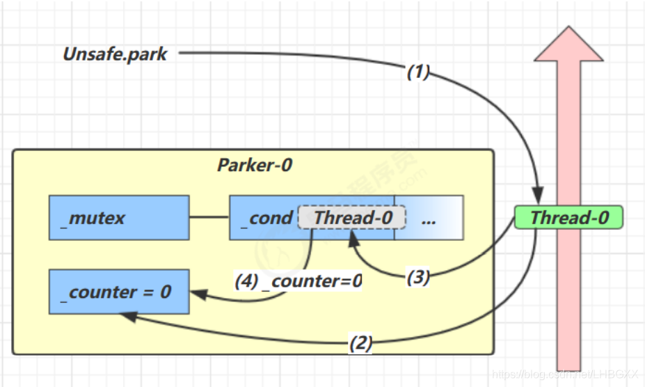

## 一、基本使用

它们是 `LockSupport` 类中的方法

```java
// 暂停当前线程
LockSupport.park(); 
// 恢复某个线程的运行
LockSupport.unpark(暂停线程对象)
```


应用：先 `park` 再 `unpark`

```java
Thread t1 = new Thread(() -> {
       log.debug("start...");
       sleep(1);
       log.debug("park...");
       LockSupport.park();
       log.debug("resume...");
   },"t1");
   t1.start();
   sleep(2);
   log.debug("unpark...");
   LockSupport.unpark(t1);
}
14:03:01.438 c.test21: [t1] - start...
14:03:02.444 c.test21: [t1] - park...
14:03:04.399 c.test21: [main] - unpark...
14:03:04.399 c.test21: [t1] - resume...

```


应用：先`upark`后`park`，`park`不住

```java
package com.concurrent.test4;

import lombok.extern.slf4j.Slf4j;

import java.util.concurrent.TimeUnit;
import java.util.concurrent.locks.LockSupport;

@Slf4j(topic = "c.test21:")
public class Test26 {
    public static void main(String[] args) throws InterruptedException{
        Thread t1 = new Thread(() -> {
            log.debug("start...");
            try {
                TimeUnit.SECONDS.sleep(1);
            } catch (InterruptedException e) {
                e.printStackTrace();
            }
            log.debug("park...");
            LockSupport.park();
            log.debug("resume...");
        },"t1");
        t1.start();
        log.debug("unpark...");
        LockSupport.unpark(t1);
    }

}
14:03:35.565 c.test21: [t1] - start...
14:03:35.565 c.test21: [main] - unpark...
14:03:36.572 c.test21: [t1] - park...
14:03:36.572 c.test21: [t1] - resume...

```


## 二、特点

与 Object 的 wait & notify 相比

- wait，notify 和 notifyAll 必须配合 Object Monitor 一起使用，而 park，unpark 不必
- park & unpark 是以线程为单位来【阻塞】和【唤醒】线程，而 notify 只能随机唤醒一个等待线程，notifyAll是唤醒所有等待线程，就不那么【精确】

- park & unpark 可以先 unpark，而 wait & notify 不能先 notify

  


## 三、park unpark 原理

每个线程都有自己的一个 Parker 对象，由三部分组成 _counter ， _cond 和 _mutex . 打个比喻线程就像一个旅人，Parker 就像他随身携带的背包，条件变量就好比背包中的帐篷。_counter 就好比背包中的备用干粮（0 为耗尽，1 为充足）调用 park 就是要看需不需要停下来歇息,如果备用干粮耗尽，那么钻进帐篷歇息. 如果备用干粮充足，那么不需停留，继续前进调用 unpark，就好比令干粮充足.如果这时线程还在帐篷，就唤醒让他继续前进,如果这时线程还在运行，那么下次他调用 park 时，仅是消耗掉备用干粮，不需停留继续前进,因为背包空间有限，多次调用 unpark 仅会补充一份备用干粮



- 当前线程调用 Unsafe.park() 方法
- 检查 _counter ，本情况为 0，这时，获得 _mutex 互斥锁

- 线程进入 _cond 条件变量阻塞
- 设置 _counter = 0


- 调用 Unsafe.unpark(Thread_0) 方法，设置 _counter 为 1
- 唤醒 _cond 条件变量中的 Thread_0

- Thread_0 恢复运行
- 设置 _counter 为 0


- 调用 Unsafe.unpark(Thread_0) 方法，设置 _counter 为 1
- 当前线程调用 Unsafe.park() 方法检查

- _counter ，本情况为 1，这时线程无需阻塞，继续运行
- 设置 _counter 为 0


## 四、park/unpark 原理总结


### park 操作

1.获取当前线程关联的 Parker 对象。

2.将计数器置为 0，同时检查计数器的原值是否为 1，如果是则放弃后续操作。

3.在互斥量上加锁。

4.在条件变量上阻塞，同时释放锁并等待被其他线程唤醒，当被唤醒后，将重新获取锁。

5.当线程恢复至运行状态后，将计数器的值再次置为 0。释放锁。


### unpark 操作：

6.获取目标线程关联的 Parker 对象（注意目标线程不是当前线程）。

7.在互斥量上加锁。

8.将计数器置为 1。

9.唤醒在条件变量上等待着的线程。

10.释放锁。


